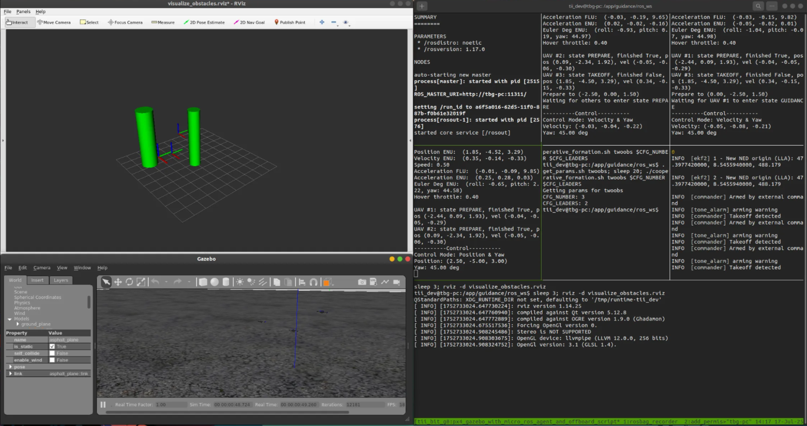

# Project MUSK (Multi-UAV Simulation Kit)

A lightweight multi-UAV simulation kit built on PX4 + Gazebo + ROS Noetic, packaged in Docker. Provides a clean environment for testing algorithms without embedded implementations.



## Features

- **Simulation Framework Only**: Pure simulation environment without algorithm implementations
- **Multi-UAV Support**: Configure multiple quadrotors with customizable formations
- **Distributed Architecture**: Each UAV runs as independent process with ROS-based communication
- **State Machine Framework**: Coordinated flight states (takeoff, guidance, landing) with synchronization
- **Automated Workflow**: One-click multi-UAV simulation launch with tmuxinator
- **Dockerized**: Fully containerized for reproducible environments
- **Obstacle Scenarios**: Built-in obstacle configuration for navigation testing

## Tech Stack

- **PX4**: Open-source autopilot for UAV flight control
- **Gazebo**: 3D robotics simulation environment
- **ROS Noetic**: Middleware for communication and control
- **MAVROS**: Interface between ROS and MAVLink protocol
- **Tmuxinator**: Terminal multiplexer for automated multi-pane workflows
- **Docker**: Containerization for environment consistency

## Quick Start

```bash
# Run simulation (using pre-built image)
./docker/run_docker.sh

# Launch multi-UAV simulation with tmuxinator
tmuxinator start . -p tmuxinator.yml scene=two_obstacles

# Exit: Ctrl+b then q in any pane
```

## Build Custom Image

```bash
# Build your own image
./docker/build_docker.sh --push
```

Dockerfile provided for customization. Modify as needed for your requirements.

## Distributed Framework

The project provides a sophisticated distributed multi-UAV control framework:

**Architecture**
- Each UAV runs as independent Python process
- ROS-based inter-UAV communication for state and telemetry
- Leader-follower coordination with configurable hierarchy

**State Machine**
- Coordinated flight phases: INIT → TAKEOFF → PREPARE → GUIDANCE → BACK → LAND
- Distributed synchronization between UAVs
- Automatic state broadcasting and monitoring

**Safety Systems**
- Real-time collision detection and avoidance
- Flight boundary enforcement (altitude, position limits)
- Emergency landing procedures

**Flight Modes**
- Position control (takeoff, landing, waypoints)
- Velocity control for formation flying
- Acceleration control for guidance algorithms
- Attitude control with throttle calibration
- Automatic hover throttle identification using binary search

**Development Tools**
- Tmuxinator for multi-pane development workflow
- Built-in data logging and rosbag recording
- 3D trajectory visualization tools
- Real-time obstacle visualization with RViz

## Configuration

**Simulation Scenes** ([`two_obstacles.json`](guidance/ros_ws/src/multi_uav_formation/scenes/two_obstacles.json))
- UAV count and formation parameters
- Leader-follower hierarchy
- Takeoff/prepare positions
- Obstacle locations and sizes

**System Parameters** ([`params.json`](guidance/ros_ws/src/multi_uav_formation/params.json))
- Safety boundaries and distances
- Throttle calibration settings
- Control gains and optimization parameters
- Execution timing configurations

## Data Analysis & Visualization

```bash
# Plot trajectories and analyze flight data
python3 src/multi_uav_formation/multi_uav_formation/PlotSingleRun.py
```

Built-in tools for:
- 3D trajectory reconstruction
- Formation flying analysis
- Multi-UAV synchronization evaluation
- Performance metrics visualization

## Roadmap

**Planned Features**
- **ROS2 Support**: Migrate from ROS Noetic to ROS2 for improved performance and modern DDS communication
- **VTOL Support**: Extend framework to support Vertical Take-Off and Landing (fixed-wing) aircraft

## Requirements

- Docker only